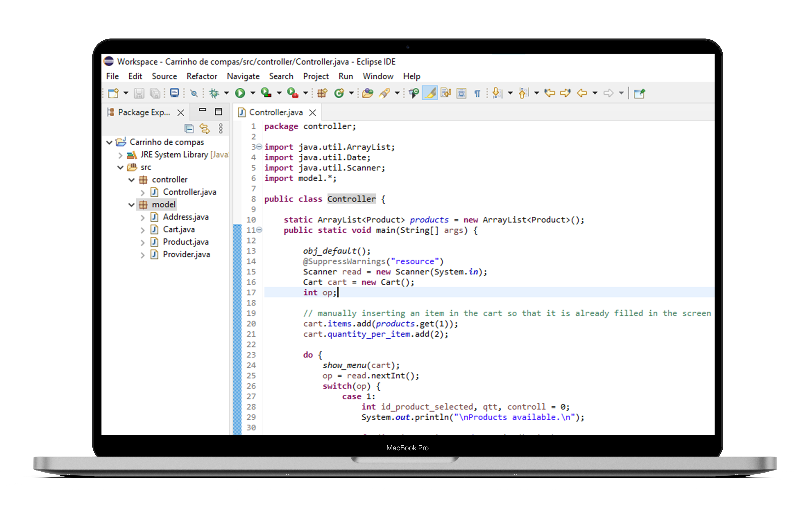
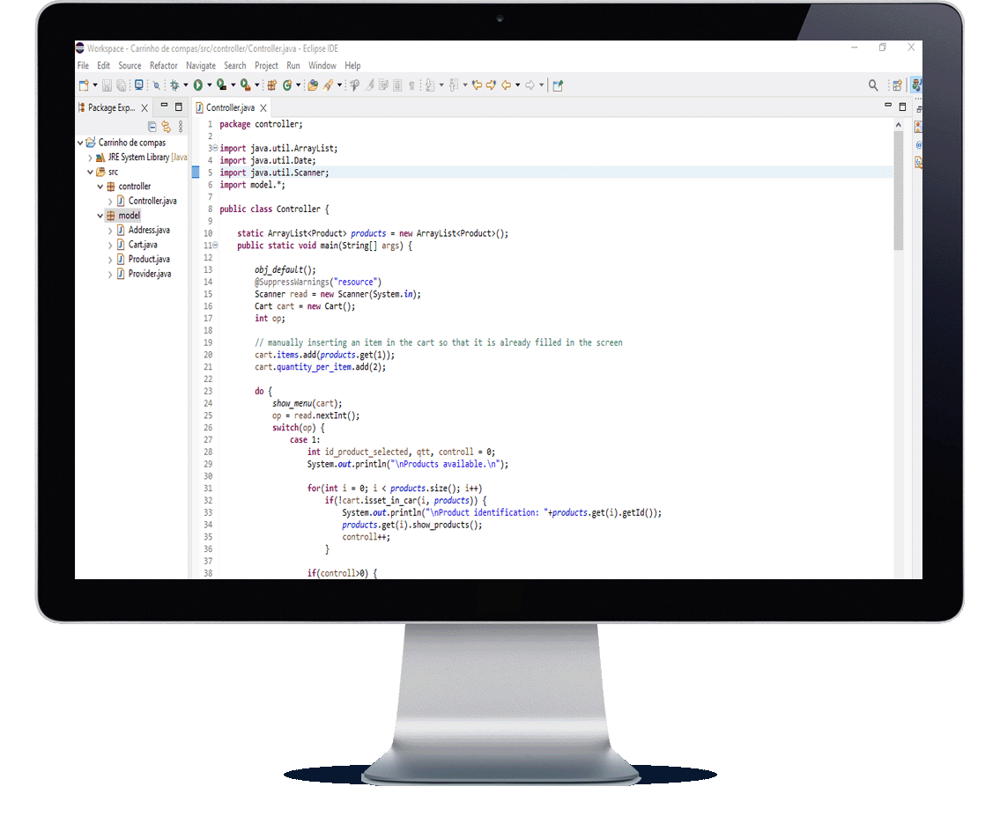

<h1 align="center"> Carrinho de compras </h1>

    <a title="Sobre" href="#-sobre">Sobre</a>&nbsp;&nbsp;•&nbsp;&nbsp;  
    <a title="Funcionalidades" href="#%EF%B8%8F-funcionalidades">Funcionalidades</a>&nbsp;&nbsp;•&nbsp;&nbsp;
    <a title="Tecnologias" href="#-tecnologias-utilizadas">Tecnologias</a>&nbsp;&nbsp;•&nbsp;&nbsp;
    <a title="Funcionamento" href="#-funcionamento">Funcionamento</a>&nbsp;&nbsp;•&nbsp;&nbsp;
    <a title="path" href="#-acesso-ao-projeto">path</a>&nbsp;&nbsp;•&nbsp;&nbsp;
    <a title="Autor" href="#-desenvolvedor">Autor</a>

    &nbsp;
    &nbsp;
    

 

    

### ✔️ Status: Concluído

## 🔎 Sobre

Este é um simples projeto feito na minha disciplina de linguagem e técnica de programação da minha faculdade. Este projeto simula um carrinho de compras.

Cada produto tem identificação, nome, valor de compra, valor de venda, data de expiração e fornecedor.

Cada fornecedor tem um nome, número de telefone, número de registo da empresa, e endereço.

Um endereço é composto por rua, número, código postal, e cidade.

## ⚒️ Funcionalidades

* Adicionar produto ao carrinho.

* Mostrar carrinho.

* Deletar um item do carrinho.

* Um produto não pode ser adicionado ao carrinho se estiver fora da validade.

## 🚀 Tecnologias utilizadas
<table>
    <tr>
        <td>Java</td>
    </tr>
</table>

## 📷 Funcionamento

    

## 📂 Acesso ao projeto 

Acesse a pasta do projeto clicando <a href="https://github.com/mmmello/Shopping-cart/tree/main/src/src">aqui</a>.

## 💻 Desenvolvedor
Matheus Mello, 2022
 
 

<i><h4 align="center">"Investir em conhecimento sempre renderá os melhores juros" 💭</h4></i>